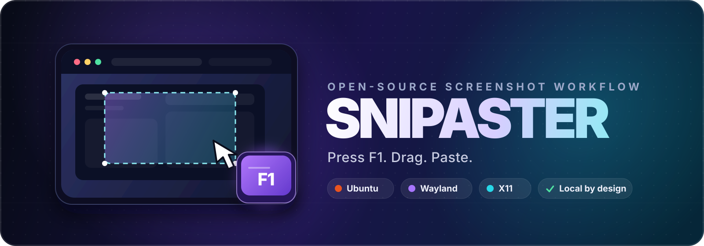
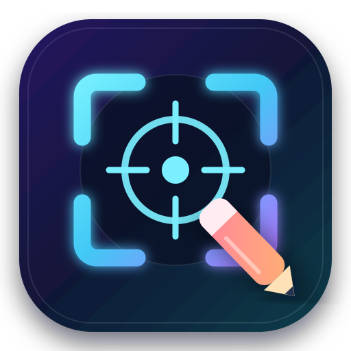
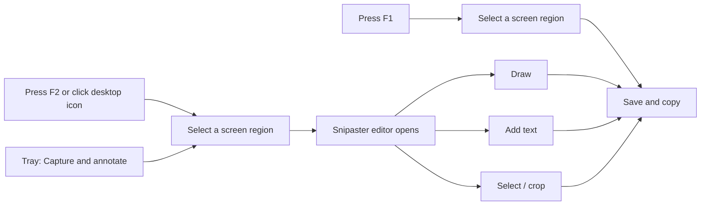

<p align="center">
  
</p>

<p align="center">
  
</p>

<h1 align="center">Snipaster</h1>

<p align="center">
  <strong>F1 copies a capture. F2 opens the annotation editor.</strong><br />
  A fast, local screenshot and annotation workflow for Windows and Ubuntu.
</p>

<p align="center">
  <a href="./LICENSE"></a>
  
  
  
  
</p>

Snipaster keeps quick capture and annotation separate:

> **F1: select a region → save → copy**
>
> **F2: select a region → draw or write → select/crop → save and copy**

Every screenshot stays on your machine. Snipaster has no account, cloud upload, analytics, or telemetry.

## What is included

| Feature | Behaviour |
|---|---|
| **F1 quick capture** | Opens a region selector, saves the PNG, and copies it to the clipboard without opening an editor. |
| **F2 annotation** | Opens the region selector, then launches the annotation editor after capture. |
| **Desktop icon** | Installs a capture-and-annotate launcher on the user's desktop and in the application menu. |
| **Tray capture icon** | Starts at login; its menu offers quick capture, annotation, screenshots, and quit. |
| **Draw** | Freehand drawing with configurable colour and brush width. |
| **Text** | Click anywhere on the image, enter text, and control its colour and size. |
| **Select** | Drag a rectangular region, then copy only that selection or crop the image to it. |
| **Undo / Redo** | Reverses drawing, text, and crop operations without modifying the source until Save. |
| **Clipboard** | Copies the initial capture immediately; Save and Copy refresh the clipboard with the edited image. |
| **Local history** | Stores timestamped PNG files under `~/Pictures/Screenshots/`. |

## Quick start

### Windows installer

Build the signed-in user's Windows application and setup executable with:

```powershell
winget install --id Astral.uv
winget install --id JRSoftware.InnoSetup
.\build_windows.ps1
```

The build creates these standalone artifacts, with the Snipaster reticle-and-pen
logo embedded in both:

```text
dist\Snipaster.exe
dist\Snipaster-Setup-0.2.0.exe
```

Run `Snipaster-Setup-0.2.0.exe` to use the standard Windows setup wizard. It
offers Full, Compact, and Custom installation types, with optional components
for the Start Menu shortcut, the Desktop annotation shortcut, and the tray
process that provides the global F1/F2 hotkeys at sign-in. The installer is
per-user, installs no service, and does not require administrator access.

The installed application lives under `%LOCALAPPDATA%\Programs\Snipaster`.
Its Start Menu and Desktop shortcuts open the annotation workflow.

### Source installer

```bash
git clone https://github.com/groxaxo/Snipaster.git
cd Snipaster

# Recommended animated installer
uv run install_snipaster.py
```

On Windows, install `uv` first if necessary, then run the same command from
PowerShell. The source installer creates a private runtime and does not require
an administrator prompt. Use the setup executable above for the normal Windows
installation experience.

The installer will:

1. Install the platform's required graphical runtime.
2. Install Snipaster into a user-level application directory.
3. Create application-menu and desktop launchers.
4. Enable the capture tray icon at login.
5. Bind <kbd>F1</kbd> for quick capture and <kbd>F2</kbd> for annotation through the tray process on Windows, GNOME shortcuts, or `xbindkeys`.

> [!IMPORTANT]
> Run the installer as your normal desktop user. On Ubuntu, do not use `sudo`; the installer requests it only when `apt` needs missing packages.

### Plain installer

The plain entry point has no animated-terminal dependency:

```bash
python3 screenshot_setup.py
```

The installed desktop application uses Ubuntu's system Python and PyQt5. The animated installer alone uses the `asciimatics` dependency resolved by `uv`.

## Everyday workflow



1. Press <kbd>F1</kbd> and drag over the part of the screen to capture and copy it immediately.
2. Press <kbd>F2</kbd>, click **Snipaster** on the desktop, or choose **Capture and annotate** from the tray menu to edit a capture.
3. Use **Draw**, **Text**, or **Select** in the editor.
4. Choose **Crop** or **Copy selection** when a selection is active.
5. Click **Save & Close**, then paste with <kbd>Ctrl</kbd> + <kbd>V</kbd>.

Cancelling the region selector creates no file and does not open the editor.

## Editor shortcuts

| Shortcut | Action |
|---|---|
| <kbd>D</kbd> | Draw tool |
| <kbd>T</kbd> | Text tool |
| <kbd>S</kbd> | Selection tool |
| <kbd>Ctrl</kbd> + <kbd>Z</kbd> | Undo |
| <kbd>Ctrl</kbd> + <kbd>Y</kbd> or <kbd>Ctrl</kbd> + <kbd>Shift</kbd> + <kbd>Z</kbd> | Redo |
| <kbd>Ctrl</kbd> + <kbd>C</kbd> | Copy selection, or the whole image when none is selected |
| <kbd>Ctrl</kbd> + <kbd>Shift</kbd> + <kbd>C</kbd> | Copy the selected region |
| <kbd>Ctrl</kbd> + <kbd>S</kbd> | Save the edited PNG and copy it |
| <kbd>Ctrl</kbd> + <kbd>Shift</kbd> + <kbd>S</kbd> | Save As |
| <kbd>Ctrl</kbd> + <kbd>Enter</kbd> | Save and close |
| <kbd>Esc</kbd> | Clear selection; press again to close |

## Capture backends

| Desktop session | Region capture | Hotkey integration | Status |
|---|---|---|---|
| Windows 10/11 | Native Qt virtual-desktop capture | F1 quick capture and F2 annotation through the tray process | Supported |
| Ubuntu GNOME on Wayland | `gnome-screenshot` | F1/F2 GNOME custom shortcuts through `gsettings` | First-class |
| Ubuntu GNOME on X11 | `gnome-screenshot` or `scrot` | F1/F2 GNOME custom shortcuts through `gsettings` | First-class |
| Other X11 desktops | `scrot` | F1/F2 managed block inside the existing `~/.xbindkeysrc` | Supported |
| wlroots Wayland compositors | `grim` + `slurp` when already installed | Bind `snipaster capture` and `snipaster annotate` in the compositor | Manual hotkeys |

The X11 installer is idempotent and preserves unrelated `xbindkeys` shortcuts. It replaces only the block delimited by Snipaster's managed markers.

The Windows setup executable installs under `%LOCALAPPDATA%\Programs\Snipaster`.
The source installer uses `%LOCALAPPDATA%\Snipaster`. Both offer user-level
launchers and a startup tray process; screenshots are saved under
`%USERPROFILE%\Pictures\Screenshots`.

## Files installed

<details>
<summary><strong>Show the complete user-level footprint</strong></summary>

| Path | Purpose |
|---|---|
| `~/.local/share/snipaster/snipaster.py` | Capture, tray, editor, drawing, text, selection, crop, save, and clipboard application |
| `~/.local/share/snipaster/snipaster-icon.svg` | Application icon used directly by Snipaster |
| `~/.local/bin/snipaster` | Stable command-line launcher |
| `~/.local/bin/snipaster_shot` | Compatibility launcher for existing installations |
| `~/.local/share/icons/hicolor/scalable/apps/snipaster.svg` | Desktop and tray icon |
| `~/.local/share/applications/snipaster.desktop` | Application-menu launcher |
| `~/Desktop/Snipaster.desktop` | One-click desktop capture launcher |
| `~/.config/autostart/snipaster-tray.desktop` | Starts the capture icon after login |
| `~/Pictures/Screenshots/` | Timestamped PNG captures |

| Windows path | Purpose |
|---|---|
| `%LOCALAPPDATA%\Programs\Snipaster\Snipaster.exe` | Standalone Windows application installed by the setup executable |
| `%APPDATA%\Microsoft\Windows\Start Menu\Programs\Snipaster\Snipaster.lnk` | Optional Start Menu annotation shortcut |
| `%USERPROFILE%\Desktop\Snipaster.lnk` | Optional Desktop annotation shortcut |
| `%APPDATA%\Microsoft\Windows\Start Menu\Programs\Startup\Snipaster Tray.lnk` | Optional startup tray process for F1/F2 |

GNOME also receives one custom shortcut named **Snipaster Capture**. Non-GNOME X11 receives one managed block in `~/.xbindkeysrc` and an `xbindkeys` autostart entry.

### Ubuntu packages

The installer checks and installs only missing packages from this runtime set:

```text
python3-pyqt5
libqt5svg5
qtwayland5
gnome-screenshot
scrot
xbindkeys
libnotify-bin
xdg-utils
```

</details>

## Command line

```bash
# Capture a region and copy it to the clipboard
snipaster capture

# Capture a region and open the annotation editor
snipaster annotate

# Open an existing image in the editor
snipaster edit ~/Pictures/Screenshots/example.png

# Run the persistent tray capture icon
snipaster tray

# Open the screenshot folder
snipaster open-folder
```

Running `snipaster` with no subcommand is equivalent to `snipaster capture`.

## Troubleshooting

### F1 or F2 does not work

Run the capture command directly:

```bash
~/.local/bin/snipaster capture
~/.local/bin/snipaster annotate
```

On GNOME, inspect the registered shortcut:

```bash
gsettings get org.gnome.settings-daemon.plugins.media-keys custom-keybindings
```

You can also open **Settings → Keyboard → View and Customize Shortcuts → Custom Shortcuts** and confirm that **Snipaster Capture** uses <kbd>F1</kbd> and **Snipaster Annotate** uses <kbd>F2</kbd>.

On Windows, install the **Tray icon and global F1/F2 hotkeys at sign-in**
component, then restart Snipaster from the Startup folder or sign out and back
in. If another application has already registered either key, Snipaster leaves
both hotkeys unregistered and shows a tray warning.

### The tray icon is not visible

Restart it manually:

```bash
pkill -f 'snipaster.py tray' 2>/dev/null || true
~/.local/bin/snipaster tray
```

Snipaster checks whether the desktop exposes a system tray. When it does not, F1, the desktop launcher, and the application-menu launcher continue to work normally.

### The desktop launcher opens as a text file

The installer marks it executable and asks GNOME to trust it. Some desktop configurations still require **right-click → Allow Launching** once. The same launcher is always available from the application menu.

### Capture works but the editor does not open

Validate the graphical runtime:

```bash
/usr/bin/python3 -c 'from PyQt5 import QtCore, QtGui, QtWidgets; print("PyQt5 OK")'
printf 'session=%s\ndesktop=%s\n' "$XDG_SESSION_TYPE" "$XDG_CURRENT_DESKTOP"
```

Then rerun the installer to restore missing runtime packages and installed files.

## Uninstall

On Windows, open **Installed apps**, select **Snipaster**, and choose
**Uninstall**. This removes the application, optional shortcuts, and startup
entry but leaves saved screenshots untouched.

On Ubuntu, remove the user-level application and launchers:

```bash
pkill -f 'snipaster.py tray' 2>/dev/null || true
rm -rf ~/.local/share/snipaster
rm -f ~/.local/bin/snipaster ~/.local/bin/snipaster_shot
rm -f ~/.local/share/applications/snipaster.desktop
rm -f ~/.local/share/icons/hicolor/scalable/apps/snipaster.svg
rm -f ~/Desktop/Snipaster.desktop
rm -f ~/.config/autostart/snipaster-tray.desktop
rm -f ~/.config/autostart/snipaster-xbindkeys.desktop
```

Then remove **Snipaster Capture** and **Snipaster Annotate** from GNOME custom
shortcuts, or delete the Snipaster managed block from `~/.xbindkeysrc` on
non-GNOME X11. Existing screenshots and shared Ubuntu packages are intentionally
left untouched.

## Local validation

Validate the source on Ubuntu or Windows:

```bash
python3 -m py_compile \
  snipaster.py \
  snipaster_installer.py \
  install_snipaster.py \
  screenshot_setup.py

python3 -m unittest discover -s tests -v
```

Build the standalone Windows application and component-selecting setup
executable with:

```powershell
.\build_windows.ps1
```

## License

Snipaster is free and open-source software released under the [MIT License](./LICENSE).
