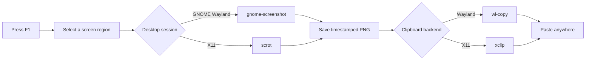

<p align="center">
  
</p>

<h1 align="center">Snipaster</h1>

<p align="center">
  <strong>A fast, local screenshot workflow for Ubuntu.</strong><br />
  Press <kbd>F1</kbd>, drag over a region, then paste the captured image anywhere.
</p>

<p align="center">
  <a href="./LICENSE"></a>
  
  
  
</p>

Snipaster turns a single hotkey into the full capture loop: **select → save → copy → paste**. It configures the appropriate Linux screenshot and clipboard tools, stores timestamped PNG files under `~/Pictures/Screenshots/`, and keeps every capture on your machine—no account, cloud upload, or telemetry.

## Why Snipaster?

- **One-key workflow:** <kbd>F1</kbd> starts an interactive region capture.
- **Clipboard-ready:** the resulting PNG is copied immediately for pasting into chat, documents, image editors, and issue trackers.
- **Wayland and X11 aware:** GNOME Wayland uses `gnome-screenshot`, `gsettings`, and `wl-copy`; X11 uses `scrot`, `xbindkeys`, and `xclip`.
- **Automatic filing:** captures are preserved with timestamped names, not discarded after copying.
- **Two installers:** choose a colorful terminal experience or a plain dependency-light setup script.
- **Transparent and hackable:** the entire workflow is a pair of small Python installers plus a generated shell wrapper.

## Quick start

```bash
git clone https://github.com/groxaxo/Snipaster.git
cd Snipaster

# Recommended: animated terminal installer
uv run install_snipaster.py
```

Once installation completes, press <kbd>F1</kbd>, select an area, and paste with <kbd>Ctrl</kbd> + <kbd>V</kbd>.

> [!NOTE]
> The installer requests `sudo` only to install missing Debian packages through `apt`. The hotkey, capture wrapper, screenshots, and desktop configuration are created for your current user.

### Plain installer

Do not need the animated UI? Run the standard-library installer directly:

```bash
python3 screenshot_setup.py
```

The animated installer requires Python 3.11+ and [`uv`](https://docs.astral.sh/uv/getting-started/installation/), which resolves the pinned `asciimatics` dependency from this repository. The plain installer only requires Python 3 and the normal Ubuntu package manager.

## How it works



Every successful capture is written to:

```text
~/Pictures/Screenshots/screenshot-YYYY-MM-DD-HH-MM-SS.png
```

A desktop notification confirms that the screenshot was saved and copied whenever `notify-send` is available.

## Compatibility

| Environment | Capture backend | Hotkey integration | Clipboard | Support level |
|---|---|---|---|---|
| Ubuntu GNOME on Wayland | `gnome-screenshot` | GNOME custom shortcut via `gsettings` | `wl-copy` | First-class |
| Ubuntu/Debian on X11 | `scrot` | `xbindkeys` with autostart | `xclip` | Supported |
| Other Wayland compositors | `grim` + `slurp` fallback in the generated wrapper | Configure in the compositor manually | `wl-copy` | Manual integration |

For a non-GNOME Wayland compositor, install `grim` and `slurp`, then bind `~/.local/bin/snipaster_shot` using your compositor's own shortcut configuration. The current automatic keybinding setup targets GNOME Wayland and X11.

> [!WARNING]
> On X11, the current installer writes `~/.xbindkeysrc`. Back up that file before installation when it already contains custom bindings.

## What the installer changes

<details>
<summary><strong>Show the complete system footprint</strong></summary>

### Packages

Missing packages are installed through `apt`:

```text
scrot
xbindkeys
xclip
gnome-screenshot
wl-clipboard
```

### Files and directories

| Path | Purpose |
|---|---|
| `~/.local/bin/snipaster_shot` | Generated capture, save, clipboard, and notification wrapper |
| `~/Pictures/Screenshots/` | Timestamped screenshot output directory |
| `~/.xbindkeysrc` | X11 hotkey configuration |
| `~/.config/autostart/xbindkeys.desktop` | Starts `xbindkeys` after login on X11 |

On GNOME Wayland, Snipaster instead adds a custom media-key entry through `gsettings` and removes the X11 autostart file when present.

</details>

## Everyday use

1. Press <kbd>F1</kbd>.
2. Click and drag over the region to capture.
3. Release to save and copy the PNG.
4. Paste it into any application that accepts images.

Cancelling the selection produces no file and leaves the clipboard unchanged.

## Troubleshooting

### Confirm the detected desktop session

```bash
printf 'session=%s\ndesktop=%s\n' "$XDG_SESSION_TYPE" "$XDG_CURRENT_DESKTOP"
```

### Confirm the generated command exists

```bash
ls -l ~/.local/bin/snipaster_shot
~/.local/bin/snipaster_shot
```

Running the second command directly separates capture problems from hotkey problems.

### Check the clipboard backend

```bash
# Wayland
command -v wl-copy

# X11
command -v xclip
```

### Inspect the GNOME shortcut registry

```bash
gsettings get org.gnome.settings-daemon.plugins.media-keys custom-keybindings
```

When <kbd>F1</kbd> is already reserved by your desktop or an application, choose another shortcut by changing the binding in the installer before running it. GNOME and `xbindkeys` use different shortcut syntaxes.

## Uninstall

Remove the generated command and X11 autostart entry:

```bash
rm -f ~/.local/bin/snipaster_shot
rm -f ~/.config/autostart/xbindkeys.desktop
killall xbindkeys 2>/dev/null || true
```

Then:

- **GNOME Wayland:** remove the **Snipaster** entry from *Settings → Keyboard → View and Customize Shortcuts → Custom Shortcuts*.
- **X11:** remove the `# Snipaster keybinding` block from `~/.xbindkeysrc`, or restore the backup you made before installation.

Snipaster intentionally leaves your screenshot files and shared system packages untouched.

## Contributing

Issues and pull requests are welcome. Useful contributions include an idempotent uninstaller, configurable hotkeys, first-class support for more Wayland compositors, packaging, and automated local test scripts.

Before submitting a change, run a syntax check locally:

```bash
python3 -m py_compile install_snipaster.py screenshot_setup.py
```

## License

Snipaster is free and open-source software released under the [MIT License](./LICENSE).
